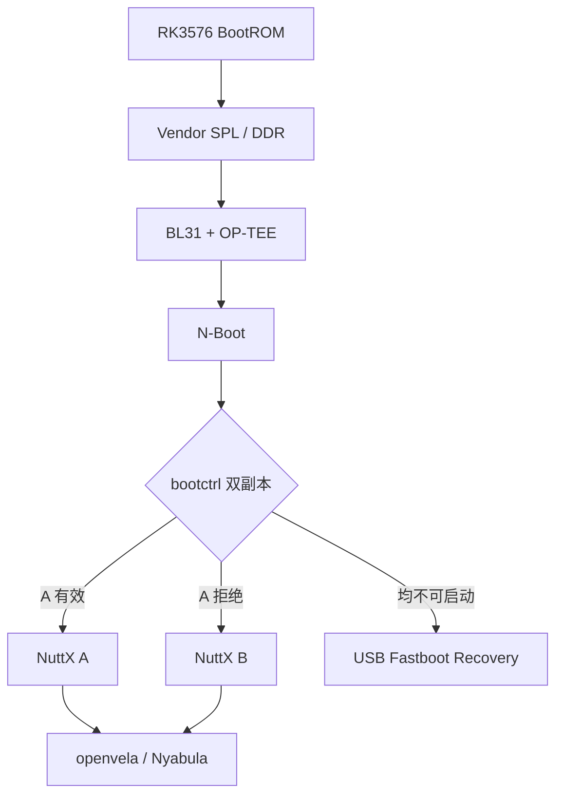

<div align="center">

# N-Boot

### 面向 Nyabula、KICKPI-K7、RK3576 与 openvela 的可靠启动管理层

**A verified, recoverable U-Boot downstream for NuttX A/B boot**

[](https://github.com/u-boot/u-boot)
[](https://www.rock-chips.com/)
[](https://www.kickpi.com/)
[](https://openvela.io/)
[](#实机验证状态)
[](Licenses/README)

```text
     __                _             _
  /\ \ \ _   _   __ _ | |__   _   _ | |  __ _
 /  \/ /| | | | / _` || '_ \ | | | || | / _` |
/ /\  / | |_| || (_| || |_) || |_| || || (_| |
\_\ \/   \__, | \__,_||_.__/  \__,_||_| \__,_|
         |___/
   ___                _
  / __\  ___    ___  | |_
 /__\// / _ \  / _ \ | __|      N - Boot
/ \/  \| (_) || (_) || |_        RK3576
\_____/ \___/  \___/  \__|
```

</div>

> [!IMPORTANT]
> N-Boot 是 U-Boot 的 Pharos Tech downstream，并非从零重写整个 U-Boot。
> 仓库保留上游历史、版权声明和适用许可证。KICKPI-K7板级支持与NuttX A/B
> 启动管理采用clean-room方式实现，没有复制Android vendor U-Boot源码。

## 为什么需要 N-Boot

Nyabula不仅需要“把系统拉起来”，还需要在远程更新失败、镜像损坏和双系统协同
场景下继续可恢复。N-Boot在vendor SPL、ATF、OP-TEE与openvela之间增加了明确的
验证和回退边界：



## 新增能力

| 能力 | 实现 | 状态 |
|---|---|---:|
| KICKPI-K7板级支持 | clean-room DTS、UART、SD、eMMC | 实机通过 |
| 双构建profile | minimal恢复版与full功能版 | 编译通过 |
| vendor BL33兼容 | 固定入口与链接地址`0x40200000` | 实机通过 |
| 原生ARM64 Image Header | 保持`_start`页对齐，满足BL31合同 | 实机通过 |
| N-Boot身份 | 启动画面、版本标识、`N-Boot>`控制台 | 实机通过 |
| 冗余bootctrl | 两份4096-byte记录、generation和CRC32 | 实机通过 |
| NuttX A/B选择 | active、priority、tries、successful | 实机通过 |
| 镜像完整性 | 长度、版本与SHA-256验证 | 实机通过 |
| 原子元数据更新 | 先写旧副本、回读、再写另一副本 | 实机通过 |
| 损坏槽自动回退 | 同一启动周期拒绝A并启动B | 实机通过 |
| active槽持久化 | 仅状态变化时写盘，稳定启动不磨损 | 实机通过 |
| 自动启动 | 有效SD优先，否则从eMMC执行`bootnuttx` | SD实机通过 |
| USB Fastboot救援 | USB gadget、自动故障进入与受控线刷 | 实机通过 |
| NuttX A/B OTA | 独立槽、回读校验与显式激活 | 实机通过 |
| 系统启动契约 | warm-reset请求、当前槽与generation交接 | 编译通过 |
| SD/eMMC双介质 | SD优先、跨介质恢复、Fastboot目标选择 | 编译通过 |

## A/B元数据模型

N-Boot在`bootctrl`分区维护两个等价记录。启动时忽略magic、版本或CRC错误的
副本，并选择generation最大的有效记录。

每个系统domain独立维护：

```text
active_slot
slot A/B:
  priority
  tries_remaining
  successful
  image_size
  image_version
  sha256
```

NuttX和后续AMP Linux不会共用active状态，因此任一侧更新或回退都不会强制切换
另一侧。

### 写入顺序

```text
写入非活动槽
  → 从介质读回
  → 校验长度与SHA-256
  → 更新较旧bootctrl副本
  → 回读并校验CRC/generation
  → 更新另一副本
  → 重启尝试新槽
```

## 实机验证状态

测试平台：KICKPI-K7、RK3576、4 GiB LPDDR5、COM14 @ 1500000。

已确认完整路径：

```text
BootROM
  → DDR v1.09
  → Vendor SPL v1.08
  → BL31 v1.20
  → OP-TEE v1.06
  → N-Boot relocation
  → bootctrl
  → NuttX EL2 → EL1 → NSH / ADB
```

故障注入结果：

```text
bootnuttx: slot a rejected (-129)
bootnuttx: booting NuttX slot b, version 1
```

最终持久状态：

| 字段 | 实测值 |
|---|---:|
| generation | 12 |
| active slot | B |
| A priority | 0 |
| B priority | 14 |
| bootctrl副本 | 4096字节逐字节一致 |
| B运行态 | NSH与ADB在线 |

## 进入 N-Boot 与恢复模式

KICKPI-K7的full profile使用零秒自动启动，不显示等待倒计时。串口和USB使用以下
参数：

| 接口 | 参数 |
|---|---|
| 调试串口 | UART0，1500000 baud，8N1，无硬件流控 |
| 交互提示符 | `N-Boot>` |
| USB恢复协议 | Android Fastboot over USB 2.0 gadget |
| USB VID:PID | `18d1:d00d` |
| Fastboot设备 | 板上承担gadget功能的OTG/Device数据口，不是只供电口 |

### 冷启动或复位时进入控制台

由于`CONFIG_BOOTDELAY=0`，不能等看到提示后再按键。先让主机在复位窗口内持续向
串口发送单字节ASCII `!`，再给板子复位或上电：

```sh
python3 -m pip install pyserial
python3 tools/nboot/request_recovery.py --port COM14
```

脚本默认以1500000 baud连续发送3秒；端口不是COM14时替换为实际端口。也可使用
任意串口工具从复位前开始持续发送`!`。命中后自动启动停止并出现`N-Boot>`。

### 从运行中的系统请求下一次启动目标

NuttX/openvela可向PMU1 GRF `OS_REG12`写入一个32-bit一次性请求，再执行保留该
寄存器的warm reset。N-Boot读取后立即清零；断电或`npor`会丢失请求。

| 地址 | 写入值 | 下一次启动行为 |
|---|---:|---|
| `0x26026230` | `0x4e425201` | 停在`N-Boot>`控制台 |
| `0x26026230` | `0x4e425202` | 直接进入USB Fastboot |
| `0x26026230` | `0x4e425203` | 本次强制尝试NuttX A槽 |
| `0x26026230` | `0x4e425204` | 本次强制尝试NuttX B槽 |

槽请求只影响本次启动，不修改`active_slot`。Fastboot请求仅在full profile中直接
进入Fastboot；minimal profile会退化为停在控制台。

### 进入 Fastboot

full profile在两个NuttX槽都不可启动时自动进入USB Fastboot。已经进入
`N-Boot>`时可手动运行：

```text
fastboot usb 0
```

主机安装Android platform-tools并连接USB数据口后，应先确认设备身份：

```sh
fastboot devices
fastboot getvar version
fastboot getvar nboot-medium
```

`nboot-medium`返回本次写入目标`sd`或`emmc`。自动模式固定选择有效SD布局，未插
SD或SD布局无效时选择eMMC；需要修复另一介质时必须在写入前显式切换：

```sh
fastboot oem board:target:auto
fastboot oem board:target:sd
fastboot oem board:target:emmc
fastboot getvar nboot-medium
```

切换目标本身不写盘，并在USB断开后恢复auto。

日常NuttX恢复不需要解锁高级模式：

```sh
fastboot stage nuttx.bin
fastboot oem board:flash:nuttx_b
fastboot oem board:activate:nuttx_b
fastboot reboot
```

允许的受控目标仅为`nuttx_a`和`nuttx_b`。写入当前可启动槽会被拒绝；目标槽在
payload写入前先失效，写完从介质读回验证，且刷写和激活为两个独立操作。

高级通用分区写入与N-Boot本体更新必须先完成短时随机挑战：

```sh
fastboot oem board:unlock-request
fastboot getvar nboot-challenge
fastboot oem board:unlock-confirm:<challenge>
fastboot flash nboot nboot.img
fastboot oem board:lock
```

授权在120秒后、USB断开后或显式`lock`后失效。`erase`、`boot`、`set_active`、
`oem run`和UUU保持禁用；`uboot`、`trust`与`bootctrl`禁止走通用写入。N-Boot
本体只接受vendor兼容的4 MiB FIT，完整验证六段SHA-256、ARM64 header、内嵌K7
DTB及分区布局后写入，并进行全分区回读比较。

> [!WARNING]
> Fastboot已在KICKPI-K7实测枚举为`18d1:d00d`，NuttX B槽写入、回读、激活、
> 重启以及N-Boot本体4 MiB原位更新均已通过。N-Boot写入过程中仍禁止断电。

## 构建

### minimal恢复profile

```sh
make CROSS_COMPILE=aarch64-linux-gnu- kickpi-k7-rk3576_defconfig
make CROSS_COMPILE=aarch64-linux-gnu- -j4 u-boot-nodtb.bin u-boot.dtb
```

### full功能profile

```sh
make CROSS_COMPILE=aarch64-linux-gnu- kickpi-k7-rk3576-full_defconfig
make CROSS_COMPILE=aarch64-linux-gnu- -j4 u-boot-nodtb.bin u-boot.dtb
```

关键配置：

```text
CONFIG_TEXT_BASE=0x40200000
CONFIG_LINUX_KERNEL_IMAGE_HEADER=y
CONFIG_LNX_KRNL_IMG_TEXT_OFFSET_BASE=0x40000000
CONFIG_BOOTCOMMAND="if bootnuttx; then true; else fastboot usb 0; fi"
```

> [!NOTE]
> 当前KICKPI-K7 vendor启动链仍需匹配的DDR initializer、BL31和OP-TEE外部
> 组件。这些二进制不因本仓库而重新许可。

## 分支与贡献流程

- `n-boot/main`：受保护集成分支，只接受Pull Request；
- 功能与修复：一个commit只做一件事；
- 禁止直接推送、强推或删除集成分支；
- 通用改动后续整理为可向U-Boot上游提交的独立patch；
- K7产品策略与N-Boot品牌能力保留在downstream。

## 当前限制

vendor SPL的固定候选间距为2 MiB，但可启动FIT必须保留vendor的4 MiB布局，两个
候选物理重叠。因此：

- NuttX A/B已经完成；
- AMP Linux仅预留独立A/B分区，本PR不实现其刷写；
- N-Boot采用完整校验、单区域原位更新，不宣称断电原子性；
- IDBlock、GPT、trust和bootctrl不允许经通用Fastboot修改。

## 路线图

- [x] RK3576/KICKPI-K7 N-Boot启动
- [x] NuttX SHA-256验证启动
- [x] bootctrl双副本与A/B回退
- [x] active槽持久化与自动启动
- [x] USB Fastboot枚举与受控A/B线刷
- [x] 双槽均失效时自动进入恢复模式
- [x] 二次确认后的高级通用分区写入
- [x] 校验后N-Boot本体更新
- [ ] NuttX/AMP Linux统一OTA manifest
- [ ] 签名验证与anti-rollback

## 上游、版权与许可证

N-Boot基于[Das U-Boot](https://github.com/u-boot/u-boot)。原始U-Boot说明完整
保留在[`README`](README)，详细的N-Boot边界说明见[`NBOOT.md`](NBOOT.md)。

本仓库遵循每个源文件的SPDX标识和适用许可证。完整许可说明位于
[`Licenses/README`](Licenses/README)。U-Boot原作者、贡献者版权和Git历史均予以
保留；Pharos Tech仅对其新增实现主张相应版权。
